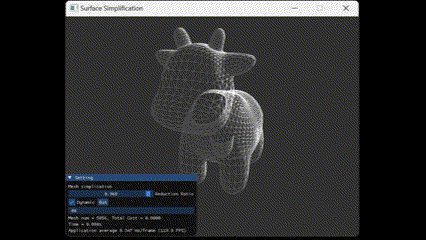

# Half-Edge Based QEM Mesh Simplification

An efficient implementation of **Quadric Error Metrics (QEM)** mesh simplification using half-edge data structure, featuring real-time visualization with GLFW and ImGUI.

## Features
- ✅ Half-edge data structure for robust topology management  
- ✅ Optimal vertex placement via QEM matrix analysis  
- ✅ Heap-based edge collapse prioritization  
- ✅ Topology preservation checks (manifold validation)  
- ✅ Real-time 3D visualization with interactive controls  
- ✅ Dynamic simplification progress monitoring  

## Technical Implementation

### Error Matrix Maintenance
During half-edge initialization:
- Compute per-face matrix:  
  $$K_p = \mathbf{p}\mathbf{p}^T$$
  where:

  $$
  \mathbf{p} = \begin{pmatrix} \vec{n} \\ -(\vec{n} \cdot \vec{v}) \end{pmatrix}
  $$

  *($\vec{n}$: face normal, $\vec{v}$: any vertex on the face)*
- Vertex error matrix $Q$ aggregates $K_p$ from all adjacent faces
- $K_p$ remains constant during optimization

### Collapse Cost Calculation
For edge $(v_1, v_2)$:

$$
\text{Cost} = \mathbf{p^*}^T(Q_1 + Q_2)\mathbf{p^*}
$$

where $\mathbf{p^*}$ is solved via:
1. Linear system $Q'\mathbf{p^*} = 0$ (when $\det(Q') > \epsilon$)
2. Test endpoints/midpoint when $Q'$ is near-singular  
- Push valid pairs into **min-heap** prioritized by cost

### Pair Selection Algorithm
- Min-heap tracks valid edge pairs (directly connected vertices only)  
- **Timestamp invalidation**:  
  - Each collapse iteration increments a timestamp  
  - Heap entries store generation timestamps  
  - A secondary `map<pair, timestamp>` tracks latest valid pairs  
  - Skip heap entries with outdated timestamps  

### Topology Preservation
Edge collapse is permitted **only** when:
1. Timestamp is current  
2. Half-edge structures remain intact  
3. No **tetrahedron collapse** (third common neighbor causing non-manifold results)  

### Post-Collapse Updates
1. Redirect neighbor half-edges from deleted faces  
2. Update twin pointers for surviving edges  
3. Subtract deleted faces $K_p$ from adjacent vertices $Q$ matrices  
4. Deallocate memory safely  

## Visualization
**GLFW/ImGUI Interface** enables:  
- 🖱️ 3D model rotation
- 🎚️ Simplification ratio slider (0.0 to 1.0)  
- ▶️ "Run" button for dynamic simplification  
- 📊 Real-time error metrics display  